### `nithin@github ~ $ ./contributions.sh`

  

### `nithin@github ~ $ whoami`

<table>
  <tr>
    <td valign="top"></td>
    <td valign="top"></td>
  </tr>
</table>

 

### `nithin@github ~ $ ls featured-projects/`

<a href="https://github.com/Nithinam16/AI-Security-Agent">AI Security Agent</a> ·
<a href="https://github.com/Nithinam16/software-supply-chain-security-scanner">Supply Chain Scanner</a> ·
<a href="https://github.com/Nithinam16/aws-security-monitor">AWS Security Monitor</a> ·
<a href="https://github.com/Nithinam16/AI-Intrusion-Detection-System">AI IDS</a>

